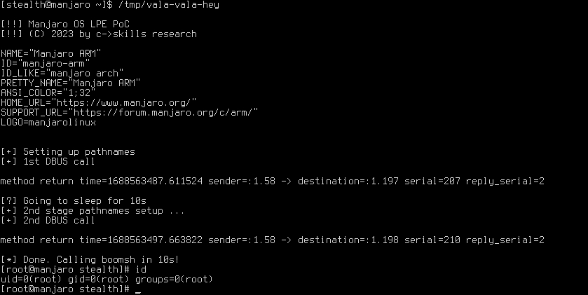

vala-vala-hey!
==============

This is a root LPE for latest *Manjaro* distro, tested on an embedded ARM install,
but it is arch agnostic and should run on any flavor of it.

The root cause is the world writable directory of the package manager DB.

Only for educational purposes! Make sure to only run in safe testing environments, as
it might trash your package DB. Use it at your own risk!

Demo run
--------

This demo runs on (as of today latest) *Manjaro* Linux dist on a RasbPi4 (ARMv8).

