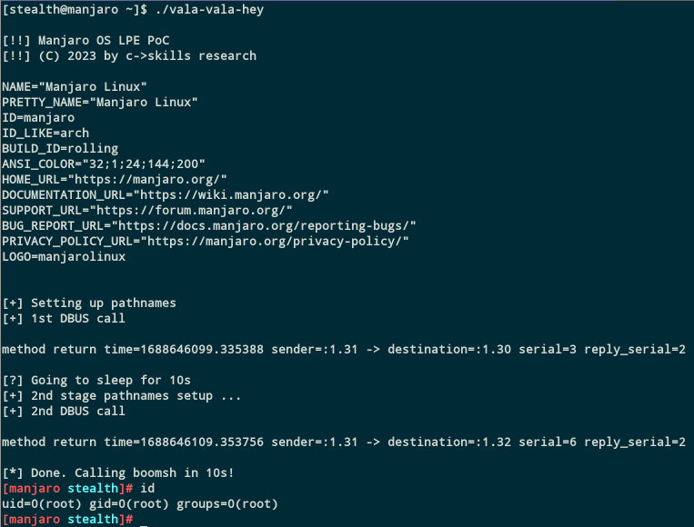

This is a 0day root LPE for latest *Manjaro* distro, tested on embedded ARM and `x86_64` desktop
installs.

The root cause is the world writable directory of the package manager DB.

Only for educational purposes! Make sure to only run in safe testing environments, as
it might trash your package DB. Use it at your own risk!

Demo run
--------

This demo runs on (as of today latest) *Manjaro* Linux dist. For *this* demo version it is necessary
that the admin previously did a `pamac update`, `pamac checkupdates` or similar in past,
to create the `refresh_timestamps` file in `/var/tmp/pamac/dbs/sync` that the exploit makes
use of.

